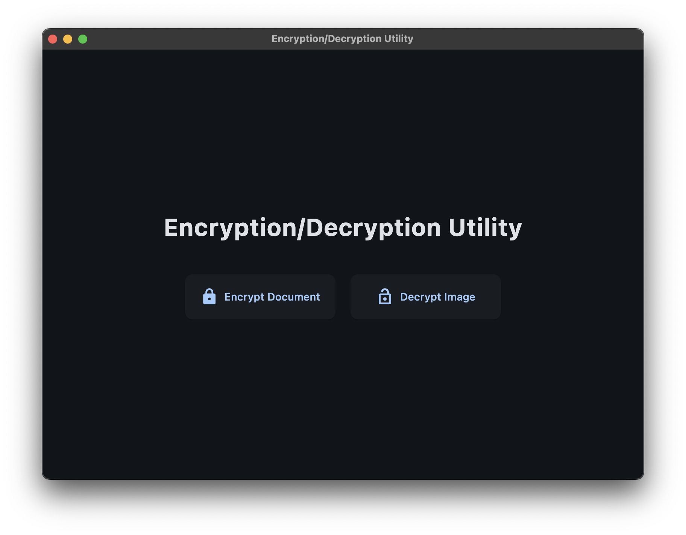
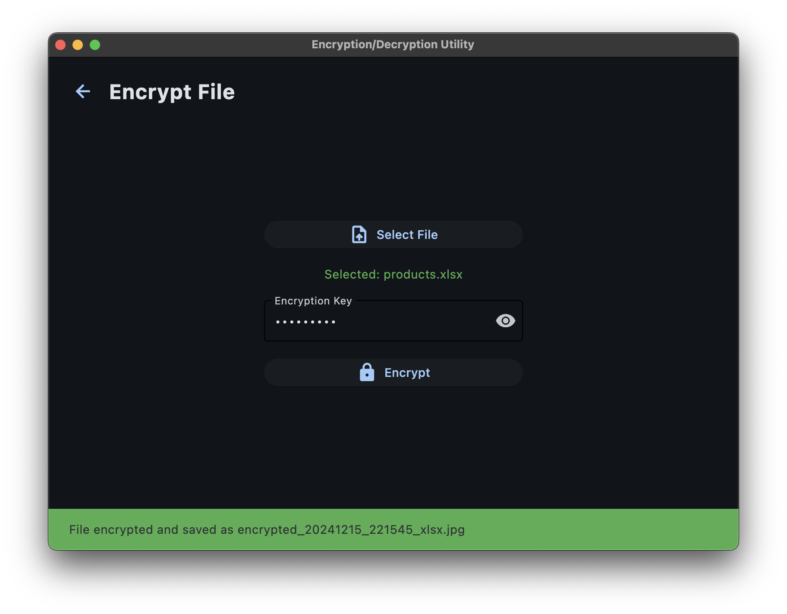
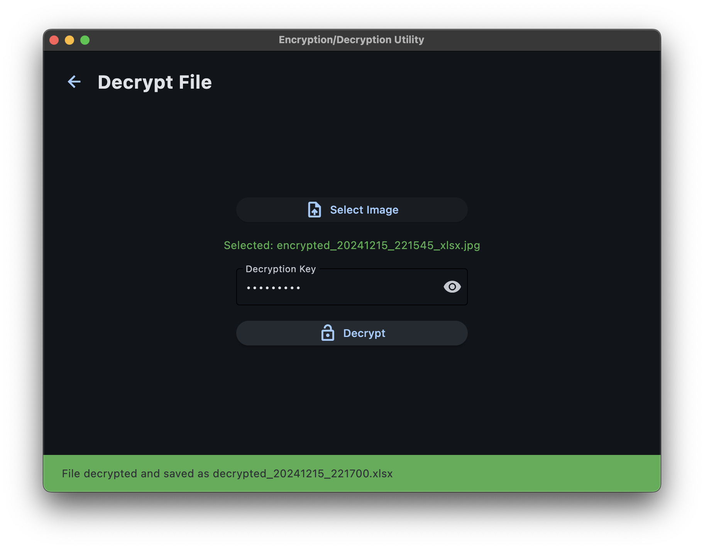

# Document Crypter

A Python desktop application for secure document encryption. Transforms documents into encrypted images and back, supporting various file formats including PDF, Word, Excel, and PowerPoint.

## Screenshots

### Main Menu


### Encryption View


### Decryption View



## Features

- Encrypt documents into JPEG images
- Decrypt images back to original document format 
- Supports multiple file formats:
  - PDF (.pdf)
  - Word (.doc, .docx)
  - Excel (.xls, .xlsx)
  - PowerPoint (.ppt, .pptx)
- File size limit: 5MB
- 9-character password requirement
- Progress tracking for encryption/decryption
- Dark mode interface

## Requirements

```
Python 3.12+
flet==0.24.1
cryptography>=42.0.0
Pillow>=10.0.0
pypdf>=4.0.0
tqdm>=4.66.0
```

## Installation

1. Clone the repository
2. Create virtual environment:
```bash
python -m venv .venv
source .venv/bin/activate  # Linux/Mac
.venv\Scripts\activate     # Windows
```
3. Install dependencies:
```bash
pip install -r requirements.txt
```

## Usage

1. Run the application:
```bash
python main.py
```

2. To encrypt:
   - Click "Encrypt Document"
   - Select document
   - Enter 9-character password
   - Click "Encrypt"

3. To decrypt:
   - Click "Decrypt Image"
   - Select encrypted image
   - Enter original password
   - Click "Decrypt"


## Security Notes

- Uses Fernet symmetric encryption (AES)
- PBKDF2HMAC key derivation
- Binary data stored in image pixels
- Original file extension preserved in filename

See instructions in the official Flet documentation to build the app https://flet.dev/docs/publish/ or use Pyinstaller (not recommended).